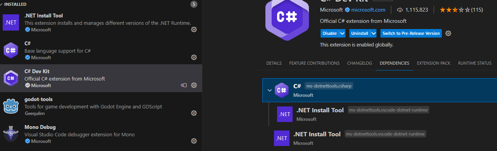
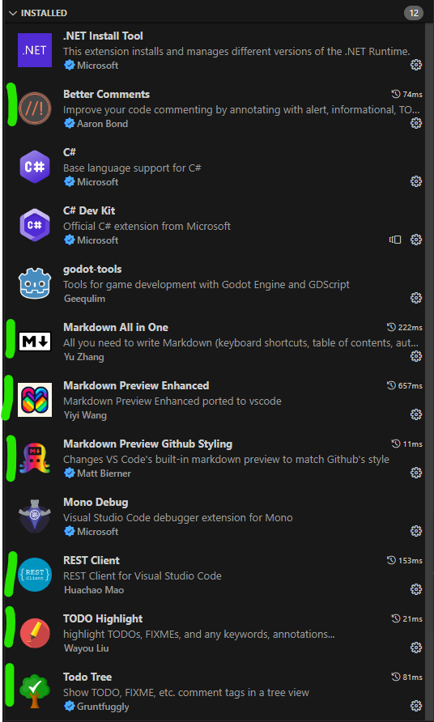

## Visual Studio Code benötigte Plgins

 

benötigten Plugins

Interessante Plugins für die Entwicklung

### Projekt spezifische dateien zum debuggen in VSCode
Im Ordner .vscode sind Dateien mit settings enthalten um Godot dotnet Projekte zu starten.

Einfach den Ordner mit in den Projektordner kopieren und die Pfade anpassen.